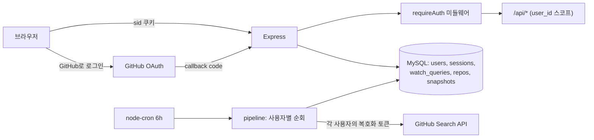

# 멀티테넌트 전환 + GitHub OAuth 인증 — 기술 설계

## 1. 아키텍처 개요

기존 단일 컨테이너 구조(Express가 API + 프론트 정적 서빙, MySQL, 인프로세스 cron)를 유지하고, 그 위에 인증 레이어와 `user_id` 스코프를 얹는다. 새 인프라 컴포넌트는 없다.



- 인증: GitHub OAuth App(ADR-0002), DB 세션 + httpOnly 쿠키(ADR-0003) — R1
- 격리: 모든 테이블에 `user_id`, 완전 사용자별 격리(ADR-0001) — R2
- ETL: cron이 유효 토큰 보유 사용자를 순회하며 각자의 토큰으로 수집 — R3
- 기존 데이터는 부팅 시 레거시 스키마 감지 → 드롭 후 v2 스키마 생성 — R6

## 2. 컴포넌트와 인터페이스

### 2.1 인증 라우트 (`backend/src/routes/auth.routes.js` + `controllers/auth.controller.js`) — 신규

- **책임**: OAuth 플로우, 세션 발급/파기, 내 정보, 계정 탈퇴
- **인터페이스**:

| Method | Path | 동작 | 근거 |
|---|---|---|---|
| GET | `/api/auth/github` | `state` 생성(랜덤 32B) → 10분짜리 httpOnly 쿠키에 저장 → GitHub authorize로 리다이렉트. **scope는 빈 값**(최소 권한) | R1.1, R1.6 |
| GET | `/api/auth/github/callback` | `state` 쿠키 검증 → code를 access_token으로 교환 → `GET /user`로 프로필 조회 → 사용자 upsert(github_id 기준) + 토큰 암호화 저장 + `token_invalid` 해제 → 세션 생성 + `sid` 쿠키 → `/`로 리다이렉트. 실패 시 `/login?error=<코드>` | R1.2, R1.3, R3.1, R3.4 |
| POST | `/api/auth/logout` | 세션 행 삭제 + 쿠키 제거 | R1.4 |
| GET | `/api/auth/me` | `{ user: {login, name, avatarUrl}, tokenInvalid }` 반환. 비로그인 시 401 | R1.5, R1.7, R3.4 |
| DELETE | `/api/auth/account` | 사용자 행 삭제(CASCADE로 토큰·쿼리·레포·스냅샷·세션 전부) + 쿠키 제거 | R5.1 |

- OAuth HTTP 호출(`github.com/login/oauth/access_token`, `api.github.com/user`)은 Node 내장 `fetch` 사용 — passport 등 인증 프레임워크는 추가하지 않는다(플로우가 리다이렉트 2회 + POST 1회로 단순, 기존 코드베이스의 최소 의존성 기조 유지).
- 신규 의존성은 `cookie-parser` 하나만 추가.

### 2.2 인증 미들웨어 (`backend/src/middleware/requireAuth.js`) — 신규

- **책임**: `sid` 쿠키 → SHA-256 해시 → `sessions` 조인 `users` 조회 → 유효하면 `req.user` 부착, 아니면 401
- **인터페이스**: `app.js`에서 `/api/queries`, `/api/repos`, `/api/etl`, `/api`(stats/trends) 마운트 전에 적용. `/api/auth/*`와 `/api/health`는 제외
- 만료 세션(`expires_at < NOW()`)은 401 처리하고 그 자리에서 행 삭제
- **근거 요구사항**: R2.1, R1.5

### 2.3 암호화 유틸 (`backend/src/utils/crypto.js`) — 신규

- **책임**: OAuth 토큰 AES-256-GCM 암복호화, 세션 토큰 생성·해시
- **인터페이스**: `encryptToken(plain) → "iv:tag:cipher"(base64)`, `decryptToken(enc)`, `newSessionToken() → {token, hash}`, `hashSessionToken(token)`
- 키는 env `TOKEN_ENCRYPTION_KEY`(64자 hex = 32바이트). **프로덕션에서 미설정 시 부팅 실패(fail-fast)** — R6.2, R3.1

### 2.4 모델 (`backend/src/models/`) — user.model.js·session.model.js 신규, 나머지 수정

- **책임**: 모든 데이터 접근에 `user_id` 스코프 강제
- **인터페이스 변경**: `query.model.js`·`repo.model.js`·`stats.model.js`(및 대응 컨트롤러)의 모든 함수 시그니처에 `userId`를 첫 인자로 추가, SQL에 `WHERE user_id = ?` 포함. id 단건 조회는 `WHERE id = ? AND user_id = ?` — 없으면 컨트롤러가 404 반환(타인 소유 여부 구분 없음)
- `query.model.create`는 삽입 전 `COUNT(*) WHERE user_id`로 상한 검사(env `MAX_QUERIES_PER_USER`, 기본 10) — 초과 시 400 + 에러 코드 `QUERY_LIMIT_EXCEEDED`
- **근거 요구사항**: R2.2–R2.5, R4.1, R4.2

### 2.5 ETL 파이프라인 (`backend/src/etl/`) — 수정

- **책임**: 사용자별 토큰으로 격리 수집
- **인터페이스 변경**:
  - `extract.js`: 모듈 로드 시 전역 Octokit 생성 제거 → `extractRepos(query, octokit)`로 인스턴스 주입. env `GITHUB_TOKEN` 의존 삭제
  - `pipeline.js`:
    - `runPipelineForUser(userId, {queryId})` — 토큰 복호화 → Octokit 생성 → 그 사용자의 활성 쿼리 수집 → `users.last_etl_at/last_etl_status/last_etl_message` 갱신. GitHub 401 응답 시 `token_invalid=TRUE`, `access_token_enc=NULL`, status `token_invalid` 기록
    - `runPipelineAllUsers()` — cron 진입점. `access_token_enc IS NOT NULL AND token_invalid = FALSE`인 사용자를 순차 순회, 사용자 단위 try/catch로 실패 격리
    - 인메모리 `etlState` 전역 객체 제거 → 실행 결과는 `users` 컬럼에 영속화, 진행 중 여부만 인메모리 per-user 락(Map)으로 관리(중복 실행 방지)
  - `etl.controller.js`: `POST /api/etl/run` → `runPipelineForUser(req.user.id, ...)`. `GET /api/etl/status` → 본인 `last_etl_*` + 실행 중 여부
- **근거 요구사항**: R3.2–R3.6

### 2.6 프론트엔드 — 신규 LoginPage + 인증 컨텍스트, 기존 화면 수정

- **`src/auth/AuthContext.tsx`** (신규): 마운트 시 `GET /api/auth/me` 1회 → `loading | authed(user, tokenInvalid) | anon`. `logout()`, `deleteAccount()` 제공
- **`src/pages/LoginPage.tsx`** (신규, 라우트 `/login`): 서비스 소개 + "GitHub로 로그인" 버튼(`<a href="/api/auth/github">`), URL `?error=` 파라미터 시 에러 배너 — R1.1, R1.3
- **라우트 가드** (`App.tsx`): `anon` → `/login`으로, 로그인 상태에서 `/login` 접근 → `/`로 리다이렉트. `loading` 동안 스피너 — R1.1, R1.5
- **`TopNav.tsx`**: 아바타 + login명 + 드롭다운(로그아웃 / 계정 삭제). 계정 삭제는 확인 모달("모든 데이터가 영구 삭제됩니다") 후 `DELETE /api/auth/account` → `/login` — R1.7, R5.3
- **토큰 무효 배너**: `tokenInvalid`면 전 화면 상단에 "GitHub 연결이 만료되었습니다. 다시 로그인해 주세요" + 재로그인 링크 — R3.4
- **`api/client.ts`**: 같은 오리진 fetch라 쿠키는 자동 전송(추가 헤더 불필요). 401 응답 공통 처리 → `/login` 이동. mock 모드(`VITE_USE_MOCK`)는 가짜 me 응답으로 로그인 상태를 흉내 내 기존 데모 기능 유지

### 2.7 부팅·설정 (`server.js`, `db/init.js`, `db/schema.sql`, `Dockerfile`) — 수정

- `db/init.js`: 부팅 시 레거시 감지(`users` 테이블 없음 && `repos` 존재) → 레거시 3테이블 DROP → v2 스키마 생성. **시드 쿼리 삽입 제거**. `db/schema.sql`도 동일 v2로 갱신(두 파일 동기 유지) — R6.1
- cron 등록(`server.js`)은 `runPipelineAllUsers()` 호출로 교체
- env 추가: `GITHUB_CLIENT_ID`, `GITHUB_CLIENT_SECRET`, `TOKEN_ENCRYPTION_KEY`, `APP_URL`(OAuth redirect_uri 계산용), `SESSION_TTL_DAYS`(기본 30), `MAX_QUERIES_PER_USER`(기본 10). `GITHUB_TOKEN` 제거. `backend/.env.example` 갱신 — R6.2
- GitHub OAuth App은 콜백 URL이 1개뿐이므로 **dev용/prod용 OAuth App을 각각 등록**(README에 안내). dev는 `http://localhost:5173/api/auth/github/callback`(Vite 프록시 경유로 쿠키가 5173 오리진에 설정됨), prod는 Railway 도메인

## 3. 데이터 모델

v2 스키마 (마이그레이션 없음 — 레거시 드롭 후 생성, R6.1):

```sql
CREATE TABLE users (
  id            INT AUTO_INCREMENT PRIMARY KEY,
  github_id     BIGINT NOT NULL UNIQUE,
  login         VARCHAR(100) NOT NULL,
  name          VARCHAR(200) NULL,
  avatar_url    VARCHAR(500) NULL,
  access_token_enc  TEXT NULL,              -- AES-256-GCM, NULL = 토큰 없음
  token_invalid     BOOLEAN NOT NULL DEFAULT FALSE,
  last_etl_at       DATETIME NULL,
  last_etl_status   ENUM('ok','error','token_invalid') NULL,
  last_etl_message  VARCHAR(500) NULL,
  created_at    DATETIME NOT NULL DEFAULT CURRENT_TIMESTAMP
);

CREATE TABLE sessions (
  id          INT AUTO_INCREMENT PRIMARY KEY,
  user_id     INT NOT NULL,
  token_hash  CHAR(64) NOT NULL UNIQUE,     -- SHA-256(sid)
  expires_at  DATETIME NOT NULL,
  created_at  DATETIME NOT NULL DEFAULT CURRENT_TIMESTAMP,
  FOREIGN KEY (user_id) REFERENCES users(id) ON DELETE CASCADE
);

-- watch_queries: user_id 추가, UNIQUE 범위 변경
--   + user_id INT NOT NULL, FK → users ON DELETE CASCADE
--   UNIQUE(query, query_type) → UNIQUE(user_id, query, query_type)

-- repos: user_id 추가, github_id 전역 UNIQUE 해제
--   + user_id INT NOT NULL, FK → users ON DELETE CASCADE
--   UNIQUE(github_id) → UNIQUE(user_id, github_id)
--   note, is_bookmarked 컬럼은 그대로 (행이 사용자별이므로 자동으로 사용자별 상태가 됨)

-- repo_snapshots: 변경 없음 (repo_id CASCADE로 사용자 삭제 시 연쇄 삭제)
```

탈퇴(R5.1)는 `DELETE FROM users WHERE id = ?` 하나로 완결된다 — sessions·watch_queries·repos가 CASCADE, repo_snapshots는 repos 경유 CASCADE.

## 4. 에러 처리

| 시나리오 | 처리 | 근거 |
|---|---|---|
| OAuth 콜백 실패 (사용자 거부·state 불일치·교환 실패·프로필 조회 실패) | `/login?error=<denied\|state\|exchange>`로 리다이렉트, LoginPage가 배너 표시 | R1.3 |
| 비인증 API 요청 / 만료 세션 | 401 `{ok:false, error}` (기존 errorHandler 포맷), 프론트 공통 처리로 `/login` 이동 | R2.1 |
| 타인 리소스 id 접근 | 404 (본인 스코프 조회 miss와 동일 응답 — 존재 비노출) | R2.5 |
| 쿼리 상한 초과 | 400 + `QUERY_LIMIT_EXCEEDED`, 프론트 토스트로 상한 안내 | R4.1 |
| ETL 중 GitHub 401 | 해당 사용자 `token_invalid=TRUE`·토큰 NULL·상태 기록 후 다음 사용자로 진행 | R3.3 |
| ETL 중 기타 사용자 단위 오류 | try/catch로 그 사용자만 `last_etl_status='error'`, 순회 계속 | R3.5 |
| ETL 중복 실행 (동일 사용자) | 인메모리 락으로 409 반환 | R3.5 |
| `TOKEN_ENCRYPTION_KEY`·OAuth env 누락 (프로덕션) | 부팅 시 fail-fast로 명확한 에러 로그 후 종료 | R6.2 |
| 토큰 복호화 실패 (키 교체 등) | 해당 사용자 `token_invalid` 처리와 동일 경로 | R3.3 |

## 5. 테스트 전략

프로젝트에 테스트 인프라가 없으므로 Node 22 내장 `node:test`를 백엔드에 도입한다(의존성 0, 최소 의존성 기조 유지). `backend/package.json`에 `"test": "node --test"` 추가.

- **단위 테스트** (`backend/test/`):
  - `crypto.test.js` — 암복호화 라운드트립, 변조된 암호문 거부, 키 미설정 시 throw (R3.1)
  - `requireAuth.test.js` — 쿠키 없음/무효 해시/만료 세션 → 401, 유효 세션 → `req.user` 부착 (R2.1, R1.5) — 모델 스텁 주입
  - `query-limit.test.js` — 상한 도달 시 생성 거부, 수정·삭제는 허용 (R4.1, R4.2)
  - `pipeline.test.js` — 401 나온 사용자 스킵·플래그 후 다음 사용자 계속 수집 (R3.3, R3.5) — Octokit·모델 스텁 주입
- **격리 검증 (통합, DB 필요)**: 로컬 MySQL에 사용자 2명·데이터 삽입 후 모델 함수가 상대 데이터를 반환하지 않는지 확인하는 스크립트 (R2.2–R2.5)
- **수동 E2E 체크리스트** (dev + Railway): 두 GitHub 계정으로 실제 OAuth 로그인 → 격리 확인 → 수동 ETL → 로그아웃 → 탈퇴 → 재로그인 시 빈 계정 (성공 기준 전체)
- 프론트엔드는 수동 QA (기존에 테스트 없음): 라우트 가드, 에러 배너, mock 모드 동작

## 6. 결정 기록

- [ADR-0001 완전 사용자별 격리](../adr/0001-per-user-data-isolation.md)
- [ADR-0002 GitHub OAuth App](../adr/0002-github-oauth-app.md)
- [ADR-0003 DB 세션 + httpOnly 쿠키](../adr/0003-db-session-httponly-cookie.md)
