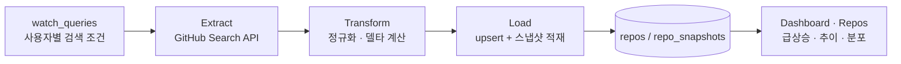
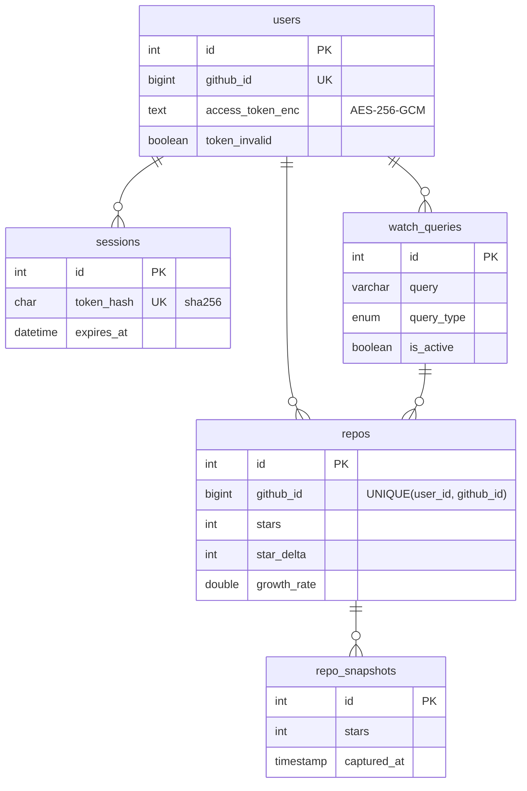

# Trendar 🛰️

> **지금 뜨는 GitHub 레포를 남들보다 먼저.** — 관심 키워드의 오픈소스를 추적해 *스타 증가율(추세)* 로 급상승 레포를 골라주는 GitHub 트렌드 레이더.

**🔗 라이브 데모 → https://trendar-production.up.railway.app** (GitHub 계정으로 로그인, 가입 불필요)

---

## 왜 만들었나

GitHub Search API는 **"현재 스타 몇 개"** 만 알려주지, **"지금 뜨고 있는지"** 는 알려주지 않는다.
그래서 정작 궁금한 *"요즘 빠르게 성장하는 레포"* 를 찾을 수가 없다.

Trendar는 관심 키워드에 매칭되는 레포의 스타 수를 **6시간마다 스냅샷으로 기록**하고,
이전 스냅샷과 비교해 **증가율(델타)** 을 계산함으로써 *"지금 뜨는 레포"* 를 보여준다.

> 💡 비유하면 체중계 앱과 같다 — 매번 몸무게를 재서(스냅샷) 어제보다 얼마 빠졌나(델타)를 보여주듯, "레포의 스타"를 계속 재는 것.

---

## 핵심 기능

- **📈 트렌드 추적** — 현재 스타가 아니라 *스타 증가율* 로 급상승 레포를 포착
- **🎯 목적형 수집** — 전체를 긁는 크롤러가 아니라, 사용자가 등록한 검색 조건(watch query)에 매칭되는 레포만 선별 수집
- **⏱ 시계열 스냅샷** — 시점별 지표를 쌓아 레포별 성장 추이를 차트로 제공
- **🧭 생태계 분포** — 관심 영역이 어떤 언어·조건으로 분포하는지 집계
- **⭐ 큐레이션** — 관심 레포를 북마크·메모로 추적
- **👥 멀티테넌트** — GitHub 로그인 기반. 검색어·레포·북마크가 **사용자별로 완전 격리**되고, 수집도 **각자의 OAuth 토큰**으로 실행되어 레이트리밋을 분산
- **🛡 남용 방지** — 수동 수집에 사용자별 **일일 한도**(기본 10회, KST 자정 리셋), 조건 개수 상한

---

## 어떻게 동작하나

크론이 6시간마다 유효한 토큰을 가진 사용자를 순회하며, **각자의 검색 조건 · 각자의 토큰**으로 수집한다.



**순서가 핵심**: 새 스냅샷을 넣기 *전에* 직전 스냅샷을 읽어야 델타가 올바르게 계산된다.
`growth_rate = (이번 스타 − 저번 스타) / max(저번 스타, 1)`, 첫 수집은 비교 대상이 없어 0으로 처리한다.

---

## 기술 스택

| 영역 | 사용 기술 |
| --- | --- |
| 언어 / 런타임 | TypeScript · Node.js |
| 프론트엔드 | React 18 · Vite · react-router-dom · Recharts |
| 백엔드 | Express (REST JSON) · node-cron |
| 외부 데이터 | GitHub Search API (`@octokit/rest`) |
| DB | MySQL (`mysql2`) |
| 인증 | GitHub OAuth App · DB 세션 + httpOnly 쿠키 · AES-256-GCM 토큰 암호화 |
| 배포 | Railway (Docker, 통합 서빙) |
| 테스트 | `node:test` (의존성 주입 기반 단위 테스트) |

---

## 아키텍처

- **백엔드** (`backend/`) — Express REST API + GitHub OAuth 인증 + 사용자별 ETL 파이프라인(크론·수동). 핵심 로직은 의존성 주입(팩토리) 구조라 DB·GitHub 없이 단위 테스트가 가능하다.
- **프론트엔드** (`frontend/`) — React SPA. 인증 컨텍스트, 401 공통 처리, 로딩/에러/빈 상태 3종을 표준화. 프로덕션에선 백엔드가 정적 빌드를 같은 오리진으로 통합 서빙한다.
- **인증 · 격리** — GitHub OAuth(스코프 없음, 공개 데이터만)로 로그인하며, 발급된 토큰은 암호화 저장 후 수집에 재사용된다. 세션은 JWT 대신 DB 세션 + httpOnly 쿠키로 로그아웃·탈퇴 시 즉시 무효화된다. 모든 데이터 API는 `user_id` 스코프로 격리된다.

<details>
<summary><b>데이터 모델 (ERD)</b></summary>



관계는 전부 `ON DELETE CASCADE` — 계정 탈퇴 시 세션·조건·레포·스냅샷이 연쇄 삭제된다.
</details>

주요 설계 결정은 ADR로 기록되어 있다 (`.claude/specs/adr/`): 완전 사용자별 격리 · OAuth App 선택 · DB 세션 · 일일 한도 카운터.

---

## 빠른 시작 (로컬)

```bash
# 1) 데이터베이스 (MySQL) — 백엔드가 부팅 시 스키마를 자동 생성한다
mysql -u root -p < db/schema.sql   # (선택) 수동 생성

# 2) 백엔드
cd backend
cp .env.example .env               # DB 접속정보 + GitHub OAuth + TOKEN_ENCRYPTION_KEY 채우기
npm install
npm run dev                        # http://localhost:4000
npm test                           # 단위 테스트

# 3) 프론트엔드
cd frontend
npm install
npm run dev                        # http://localhost:5173 (/api 는 4000으로 프록시)
```

> 백엔드 없이 UI만 보려면 `frontend/.env.local` 에 `VITE_USE_MOCK=true` 를 두면 인메모리 목 데이터로 동작한다.

### GitHub OAuth App 설정

로그인과 수집 모두 사용자의 GitHub OAuth 토큰을 쓴다. [OAuth App](https://github.com/settings/developers)을 등록하고 `GITHUB_CLIENT_ID` / `GITHUB_CLIENT_SECRET` 을 `.env` 에 넣는다.

- 콜백 URL은 1개만 지원하므로 **dev/prod 앱을 각각 등록** (dev: `http://localhost:5173/api/auth/github/callback`)
- **스코프는 요청하지 않는다** — 공개 레포 검색 + 공개 프로필만 사용. 토큰은 사용자별 레이트리밋 확보 용도이며 암호화 저장된다.
- `TOKEN_ENCRYPTION_KEY`(64자 hex)와 `APP_URL` 은 프로덕션 필수. 키 생성: `node -e "console.log(require('crypto').randomBytes(32).toString('hex'))"`

---

## 프로젝트 구조

```
trendar/
├── db/          # schema.sql (MySQL) · schema.dbml (dbdiagram.io)
├── backend/     # Express REST API · GitHub OAuth · ETL 파이프라인 · node:test
│   └── src/     # routes · controllers · models · middleware · services · etl · utils
└── frontend/    # React + Vite + TypeScript SPA (로그인 + 4 화면)
    └── src/     # pages · components · api · auth · lib · styles
```

---

## 라이선스

개인 학습·포트폴리오 프로젝트.
