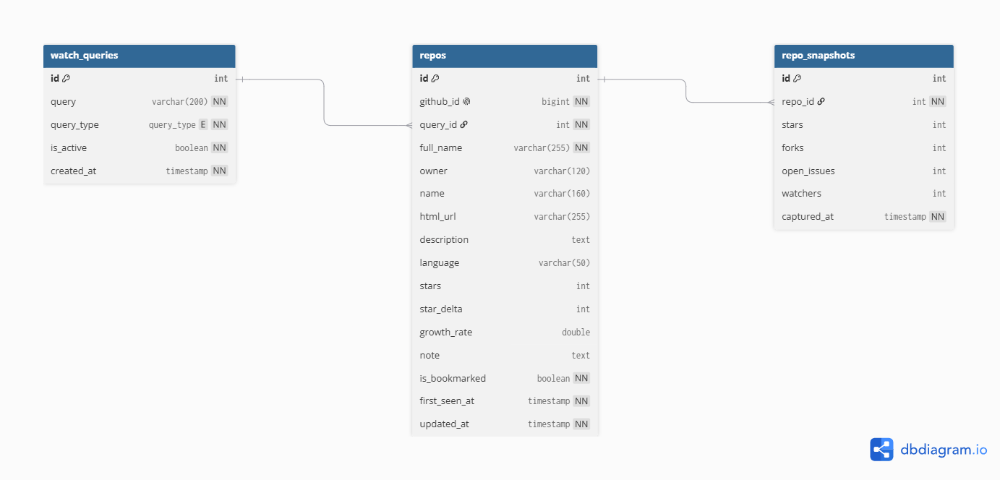

# Trendar 🛰️

**데모** : <https://trendar-production.up.railway.app> — GitHub 계정으로 로그인해 사용하는 멀티테넌트 서비스다. 검색 조건·수집 레포·북마크가 사용자별로 격리되고, 수집은 각자의 OAuth 토큰으로 실행된다.

> **AI 에이전트 스킬·툴 GitHub 트렌드 모니터** — 사용자가 등록한 검색 조건에 매칭되는 GitHub 레포만 선별 수집하고, 시점별 스냅샷을 쌓아 **스타 증가율(추세)**을 계산하는 목적형 수집기.

GitHub Search API는 "현재 스타 수"만 줄 뿐 "증가 추세"는 주지 않는다. Trendar는 시점별 스냅샷을 ETL로 쌓아 델타를 계산함으로써 **"지금 뜨는 레포"**를 보여준다.

- **트렌드** — 어떤 레포가 지금 빠르게 뜨고 있는가 (스타 증가율)
- **생태계** — 어떤 언어·조건으로 분포하는가
- **큐레이션** — 관심 레포를 북마크·메모로 추적

## 구성

```
trendar/
├── db/           # schema.sql (MySQL) · schema.dbml (dbdiagram.io)
├── backend/      # Node + Express + ETL 파이프라인
└── frontend/     # React + Vite + TypeScript 대시보드 (4 화면)
```

## 빠른 시작

```bash
# 1) 데이터베이스
mysql -u root -p < db/schema.sql   # (선택) 백엔드가 부팅 시 자동 생성하기도 한다

# 2) 백엔드
cd backend
cp .env.example .env          # DB 정보 + GitHub OAuth App + TOKEN_ENCRYPTION_KEY
npm install
npm run dev                   # http://localhost:4000
npm test                      # 단위 테스트 (node:test)

# 3) 프론트엔드
cd frontend
npm install
npm run dev                   # http://localhost:5173 (/api 는 4000으로 프록시)
```

> **팁** — 백엔드 없이 UI 전체를 데모하려면 `frontend/.env.local`에 `VITE_USE_MOCK=true`를 두고 `npm run dev` 하면 인메모리 목 데이터 + 가짜 로그인으로 동작한다. 기본값은 실제 API 호출이다.

### GitHub OAuth App 설정

로그인과 수집 모두 사용자의 GitHub OAuth 토큰을 쓴다. [GitHub OAuth App](https://github.com/settings/developers)을 등록하고 `GITHUB_CLIENT_ID`/`GITHUB_CLIENT_SECRET`을 `.env`에 넣는다.

- OAuth App은 콜백 URL을 1개만 지원하므로 **dev용/prod용 앱을 각각 등록**한다.
  - dev 콜백: `http://localhost:5173/api/auth/github/callback`
  - prod 콜백: `https://<배포 도메인>/api/auth/github/callback`
- 스코프는 요청하지 않는다(공개 레포 검색 + 공개 프로필만 사용). 토큰은 사용자별 레이트리밋(5,000 req/hr) 확보 용도이며 AES-256-GCM으로 암호화 저장된다.
- `TOKEN_ENCRYPTION_KEY`(64자 hex)와 `APP_URL`은 필수 — 프로덕션에서 누락 시 부팅이 실패한다. 키 생성: `node -e "console.log(require('crypto').randomBytes(32).toString('hex'))"`

---

## 1. GitHub 트렌드 수집 아키텍처 및 가져올 데이터

### 1-1. 목표

GitHub 전체를 범용으로 긁는 크롤러가 아니라, **사용자가 등록한 검색 조건(watch query)에 직접 연결되는 레포만 선별 수집**하는 목적형 수집기다.

> **핵심 통찰** — GitHub Search API는 "현재 스타 수"만 준다. 따라서 시점별 스냅샷을 직접 쌓아 델타를 계산해야 "지금 뜨는 레포"를 알 수 있다.

### 1-2. 기술 스택

| 항목 | 패키지 / 도구 |
| --- | --- |
| 언어 / 런타임 | TypeScript / Node.js |
| 프론트엔드 | React 18 + Vite |
| 라우팅 / 차트 | react-router-dom / recharts |
| 백엔드 / API | Express (REST JSON) |
| 외부 데이터 소스 | GitHub Search API (@octokit/rest) |
| DB / 드라이버 | MySQL / mysql2 |
| 스케줄러 | node-cron |
| 환경변수 | dotenv |
| 배포 | Railway (Docker, 통합 서빙) |

### 1-3. 데이터 수집 전략

GitHub 전체를 저장하지 않고, **watch_query에 매칭되는 레포만 선별 수집**한다. 수집의 출발점은 사용자가 등록한 검색 조건이며, `query_type`에 따라 질의를 다르게 조립한다.

- **모드** : `query_type ∈ {topic, keyword}`
- **질의** : `topic` → `topic:<query>` / `keyword` → `<query> in:name,description,readme`
- **정렬 / 상한** : `sort=stars&order=desc`, `per_page = ETL_PER_QUERY`(기본 30)
- **대상** : `is_active = true` 조건만 일괄 ETL 대상 (특정 조건은 개별 실행 가능)
- **스타 하한** : `ETL_MIN_STARS`(예: 1000) 설정 시 질의에 `stars:>=N` 추가 + 적재 가드로 2중 필터 — 1k 미만은 저장 안 함

### 1-4. 반드시 가져와야 하는 GitHub 데이터

GitHub Search API는 조건에 매칭되는 레포 객체 배열을 반환한다. 이 원본을 내부 스키마로 정규화하고, 직전 스냅샷과 비교해 증감을 계산한 뒤, 마스터(`repos`)와 시계열(`repo_snapshots`)로 적재한다.

**예시 — GitHub 검색 결과 항목**

```text
GET /search/repositories?q=hermes agent in:name,description,readme&sort=stars&order=desc

items[0] = {
  id              : 845210,                          ← github_id (멱등 upsert 키)
  full_name       : "NousResearch/hermes-agent",
  owner.login     : "NousResearch",
  html_url        : "https://github.com/NousResearch/hermes-agent",
  description     : "Self-improving autonomous AI agent ...",
  language        : "Python",
  stargazers_count: 134000,                          ← stars (이번 스냅샷)
  forks_count     : 4100,
  open_issues_count: 205,
  watchers_count  : 4100
}
```

**A. 검색 조건 (watch_query)** — `query`(검색 범위), `query_type`(질의 방식), `is_active`(일괄 대상 여부).

**B. 레포 메타데이터**
- `id → github_id` : 모든 스냅샷의 조인 PK이자 멱등 upsert 키. `full_name`은 rename 가능하지만 `github_id`는 불변.
- `full_name / owner / name` : 식별·표시. `html_url` : 원문 링크. `description` : 표시. `language` : 언어 분포 키(null 가능).

**C. 시점 지표 (스냅샷 원천)** — 매 ETL마다 `repo_snapshots`에 1행 적재.
- `stargazers_count → stars`(성장률 핵심), `forks_count → forks`, `open_issues_count → open_issues`, `watchers_count → watchers`.

**D. 파생 지표 (델타 / 성장률)**
- `star_delta = stars_now − stars_prev` (첫 수집은 0)
- `growth_rate = star_delta / max(stars_prev, 1)` (비율, 0.009 = 0.9%)

> **참고** — `star_delta`/`growth_rate`는 `repos`에 **캐시 컬럼**으로 두어 목록 정렬·급상승 조회를 가속한다. (없으면 조회 시 스냅샷 2개를 비교해 계산도 가능)

**E. 최초 수집 판별** — upsert가 신규 INSERT인지로 "처음 발견된 레포"를 판별, `first_seen_at`은 최근 수집순 정렬 기준.

### 1-5. 선택적으로 가져오면 좋은 데이터

- **README / topics 태그** — 정밀 카테고리 분류 보강. *선택적 이유: 레포당 추가 호출(레이트리밋), 정책 미확정.*
- **컨트리뷰터 / 커밋 활동** — 활성도 점수(activity) 보강. *선택적 이유: "활성도" 정의 미확정.*

### 1-6. 데이터 매핑 전략 (2단 구조)

- **Layer 1 (원시 시계열)** — `repo_snapshots` : 시점별 원시 지표. 모든 파생의 출발점이자 진실의 원천.
- **Layer 2 (도메인)** — `watch_queries`(수집 조건 마스터), `repos`(정규화 레포 마스터 + 파생 캐시).

**시점별 원시 스냅샷을 먼저 쌓은 뒤** → 그 위에 **레포 마스터·파생 지표**를 만들고 → 다시 **대시보드 집계**(통계·급상승·언어분포)를 파생시키는 구조. 집계는 현재 조회 시 계산하며, 트래픽 증가 시 사전 집계 테이블로 확장 가능하다.

### 1-7. ETL 파이프라인

수동 트리거(`POST /api/etl/run`)와 cron 자동 동기화를 모두 지원한다. 멱등성(`github_id` upsert)·조건별 에러 격리·재실행을 보장한다.


> ⚠️ **순서 주의** — 이번 스냅샷을 넣기 전에 직전 스냅샷을 먼저 읽어야 델타가 올바르게 계산된다. 순서가 뒤바뀌면 `star_delta`가 항상 0이 된다.

---

## 2. 요구사항

### 2-1. 기능적 요구사항

| ID | 요구사항 | 비고 |
| --- | --- | --- |
| FR-01 | 검색 조건 등록 / 수정 / 삭제 | CRUD 핵심 |
| FR-02 | 조건 활성 / 비활성 토글 | `is_active` |
| FR-03 | ETL 수동 실행 (전체 / 특정 조건) | `POST /api/etl/run` |
| FR-04 | ETL cron 자동 실행 | `ETL_CRON` (기본 6h) |
| FR-05 | GitHub 레포 검색·정규화 수집 | extract + transform |
| FR-06 | `github_id` 기준 멱등 upsert | 중복 행 방지 |
| FR-07 | 시점별 스냅샷 적재 | 시계열 원천 |
| FR-08 | `star_delta` / `growth_rate` 파생 계산 | 추세 산출 |
| FR-09 | 레포 목록 검색 / 정렬 / 필터 / 페이지네이션 | Repos 화면 |
| FR-10 | 레포 북마크 / 메모 수정 | Update |
| FR-11 | 레포 삭제 | Delete |
| FR-12 | 대시보드 통계 / 급상승 / 언어 분포 | Dashboard |
| FR-13 | 레포 상세 + 스타 추이 차트 | RepoDetail |
| FR-14 | 마지막 ETL 실행 상태 조회 | `GET /api/etl/status` |
| FR-15 | 조건 삭제 시 연관 레포·스냅샷 cascade | 정합성 |
| FR-16 | 스타 하한 필터(`ETL_MIN_STARS`)로 1k 이상만 수집·저장 | 추출 한정자 + 적재 가드 |

### 2-2. 비기능적 요구사항

- **레이트리밋** — 사용자별 OAuth 토큰(각 5,000 req/hr)으로 수집을 분산, 조건당 검색 1~2회로 제한
- **테넌트 격리** — 모든 데이터가 사용자별로 완전 격리(`user_id` 스코프), 비인증 API는 401, 타인 리소스는 404
- **멱등성** — `(user_id, github_id)` upsert로 중복 행 금지, 스냅샷만 누적
- **정합성** — repo는 유효한 watch_query에, snapshot은 유효한 repo에 연결(FK `ON DELETE CASCADE`), 계정 탈퇴 시 토큰 포함 전체 데이터 연쇄 삭제
- **에러 처리** — 일관된 `{ ok:false, error }` JSON, 사용자·조건별 실패 격리(한 사용자의 토큰 무효가 다른 사용자 수집에 영향 없음)
- **3-상태 UI** — 모든 비동기 호출에 로딩/에러/빈 상태 처리, 백엔드 미기동 시 크래시 없이 토스트 안내
- **환경 분리** — OAuth 클라이언트/암호화 키/DB 접속정보는 `.env`로 분리 (커밋 금지), OAuth 토큰은 DB에 암호화 저장
- **디자인** — 다크 "레이더 관제소" 관측 도구 UI, 등폭 숫자, 높은 정보 밀도

---

## 3. 예상되는 문제 및 의문점

### 3-1. 핵심 비즈니스 이슈

1. **"뜨는 레포"의 정의** — 절대 증가(`star_delta`) vs 비율(`growth_rate`)? 134k의 +1.2k vs 640의 +140 중 무엇이 트렌디한가? 신규(델타 0) 처리?
2. **스냅샷 간격의 공정성** — cron 지연/누락 시 delta 비교가 불공정해지지 않나? "직전"이 6시간 전인지 3일 전인지에 따라 의미가 달라진다.
3. **검색 조건의 모호성** — keyword vs topic 결과 차이·중복. 같은 레포가 여러 조건에 잡힐 때 `query_id` 귀속은?
4. **데이터 신선도** — GitHub Search의 `stars`는 약간 캐시/지연될 수 있다.
5. **레포 생애주기** — rename은 `github_id`로 추적(OK). 삭제/비공개 전환 레포의 기존 행·스냅샷은 보존할지?

### 3-2. 운영 및 설계 이슈

1. **레이트리밋 관리** — 조건 수 × per_page 증가 시 한도. 분산 전략?
2. **스냅샷 보존 정책** — 무한 누적 → 다운샘플/아카이브 필요?
3. **파생 지표 위치** — 캐시 컬럼 vs 조회 시 계산.
4. **`recent` 정렬 기준** — `first_seen_at` vs `updated_at`?
5. **동시성** — cron과 수동 실행이 겹칠 때 경쟁/중복 (현재 락 없음).

> ✅ **구현 상태** — 위 이슈들을 인지한 채로 백엔드·프론트엔드·ETL·MySQL을 모두 구현했고 **Railway에 라이브 배포**되어 있다(상단 데모). 위 항목들은 향후 개선 관점으로 남겨 둔다.

---

## 4. 테스트 케이스

> 분류 표기: ✅ 정상 동작해야 함 · ❌ 발생하면 안 됨 · ➖ 부분/스킵 처리

### 4-1. ETL 수집(Extract / Transform)

| 분류 | 시나리오 |
| --- | --- |
| ✅ | `topic` 조건은 `topic:<q>` 질의로 검색된다 |
| ✅ | `keyword` 조건은 `<q> in:name,description,readme` 질의로 검색된다 |
| ✅ | GitHub 원본이 내부 스키마로 정규화된다 |
| ❌ | description/language가 null인 레포에서 예외가 발생하면 안 된다 |
| ❌ | 비활성 조건이 전체 ETL에 포함되면 안 된다 |

### 4-2. 스냅샷 / 델타

| 분류 | 시나리오 |
| --- | --- |
| ✅ | ETL 실행마다 레포별 스냅샷이 1행 추가된다 |
| ✅ | 첫 수집 레포는 `star_delta=0`, `growth_rate=0` 이다 |
| ✅ | 두 번째 수집부터 직전 스냅샷 대비 델타가 계산된다 |
| ➖ | 직전 `stars=0`이면 0 나눗셈 없이 분모를 1로 보정한다 |
| ❌ | 스냅샷을 넣은 뒤 직전을 읽어 델타가 항상 0이 되면 안 된다(순서) |

### 4-3. 멱등성(Upsert)

| 분류 | 시나리오 |
| --- | --- |
| ✅ | 신규 레포는 INSERT되고 `repoId`가 반환된다 |
| ✅ | 동일 `github_id` 재수집 시 UPDATE되어 repos 행이 늘지 않는다 |
| ✅ | 여러 조건이 같은 레포를 반환해도 중복 행이 없다 |
| ❌ | 같은 레포가 매 실행마다 새 행으로 쌓이면 안 된다 |

### 4-4. 정합성

| 분류 | 시나리오 |
| --- | --- |
| ✅ | 모든 repo는 유효한 watch_query를 참조한다 |
| ✅ | 모든 snapshot은 유효한 repo를 참조한다 |
| ✅ | 조건 삭제 시 연관 repo·snapshot이 cascade 삭제된다 |
| ❌ | watch_query 없이 repo만 저장되면 안 된다 |
| ❌ | repo 없이 snapshot만 저장되면 안 된다 |

### 4-5. 조건(Query) CRUD

| 분류 | 시나리오 |
| --- | --- |
| ✅ | 조건을 등록하면 201과 생성 객체가 반환된다 |
| ✅ | `(query, query_type)` 중복 등록은 409 DUPLICATE로 거부된다 |
| ✅ | `is_active` 토글이 반영된다 |
| ❌ | query가 1~200자 범위를 벗어나면 저장되면 안 된다 |
| ❌ | 존재하지 않는 id 수정/삭제가 200으로 처리되면 안 된다 |

### 4-6. 레포 조회 / 필터 / 정렬

| 분류 | 시나리오 |
| --- | --- |
| ✅ | `search`로 full_name/description 부분일치 필터된다 |
| ✅ | `query_id`로 특정 조건의 레포만 조회된다 |
| ✅ | `bookmarked=true`면 북마크만 조회된다 |
| ✅ | `sort=stars\|growth\|recent` 정렬이 적용된다 |
| ✅ | `limit/offset` 페이지네이션과 `total`이 일치한다 |
| ❌ | 필터 변경 시 offset이 0으로 초기화되지 않으면 안 된다 |

### 4-7. 집계(대시보드)

| 분류 | 시나리오 |
| --- | --- |
| ✅ | total_repos / active_queries / bookmarked가 올바르다 |
| ✅ | `last_etl_at`이 최신 스냅샷 시각과 일치한다 |
| ✅ | trends가 `growth_rate` 내림차순으로 정렬된다 |
| ✅ | 언어 분포에서 `language=null`은 제외된다 |
| ➖ | 트래픽 증가 시 사전 집계 테이블로 대체 가능해야 한다 |

### 4-8. ETL 실행 / 장애 복구

| 분류 | 시나리오 |
| --- | --- |
| ✅ | 특정 `query_id`만 실행하면 해당 조건만 처리된다 |
| ✅ | 한 조건의 검색 에러가 `errors[]`에 기록되고 다음 조건은 계속된다 |
| ✅ | 실행 후 `etlState`(last_run_at/last_result)가 갱신된다 |
| ✅ | GitHub 빈 결과도 에러 없이 0건 처리된다 |
| ❌ | 한 조건 실패가 전체 ETL을 중단시키면 안 된다 |

### 4-9. 프론트엔드 상태

| 분류 | 시나리오 |
| --- | --- |
| ✅ | 데이터 로딩 중 로딩 상태가 표시된다 |
| ✅ | 빈 결과는 안내(빈 상태)로 표시된다 |
| ✅ | 백엔드 다운 시 크래시 없이 에러 토스트로 안내된다 |
| ✅ | 북마크 토글은 낙관적 반영 후 실패 시 롤백된다 |
| ➖ | 스냅샷 1개 레포는 차트 대신 "데이터 수집 중"을 표시한다 |

---

## 5. ERD 설계

관계: `watch_queries 1 ──< repos 1 ──< repo_snapshots` (모두 `ON DELETE CASCADE`).



- **`repo_snapshots`** (원시 시계열) — 시점별 지표. **시계열 = 성장률의 원천.** ETL마다 1행 적재.
- **`watch_queries`** (도메인) — 추적 검색 조건 마스터. 사용자 CRUD의 핵심.
- **`repos`** (도메인) — 수집 레포 마스터. `github_id` 멱등 upsert + 파생 캐시(`stars`/`star_delta`/`growth_rate`).

> **팁** — [`db/schema.dbml`](db/schema.dbml)을 [dbdiagram.io](https://dbdiagram.io)에 붙여넣으면 ERD를 시각화/Export 할 수 있다.

---

## 다이어그램

### 플로우 — 데이터 흐름


### 상태 — ETL 실행


### 시퀀스 — ETL 실행


---

## 문서

| 문서 | 내용 |
| --- | --- |
| [db/schema.sql](db/schema.sql) · [db/schema.dbml](db/schema.dbml) | DB 스키마 (실행 DDL · DBML) |

## 라이선스

개인 학습용 프로젝트.
